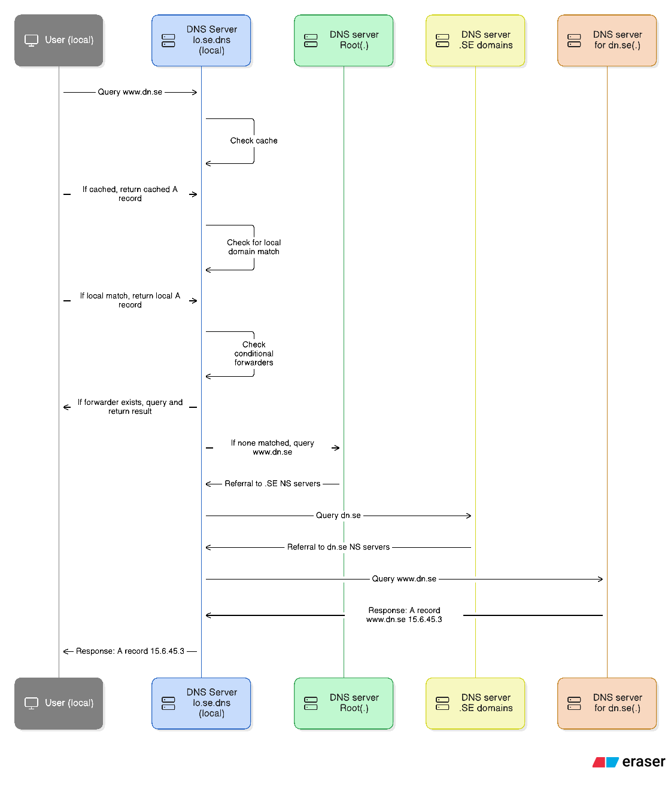

# Learning DNS: From Local Client to Public Servers

__*All IP addresses and DNS servers shown are fictive; this is for educational purposes only!*__

This diagram shows the DNS resolution process, starting from a local client querying a local DNS server, and following the chain through root servers, top level domain (.) servers, and authoritative servers until the A record for `www.dn.se` is returned.

1.  queries the local DNS server (`lo.se.dns`).
2.  (`lo.se.dns`) checks its cache, local zones, and conditional forwarders.
3. If not found, the local server queries the  server (.).
4.  server (one of 13 globally) refers the query to the  Top level domain server for .SE.
5.  Top level domain server refers the query to the  authoritative server for dn.se.
6.  authoritative server returns the A record for `www.dn.se`.
7.  caches the result and returns it to the  local user.
