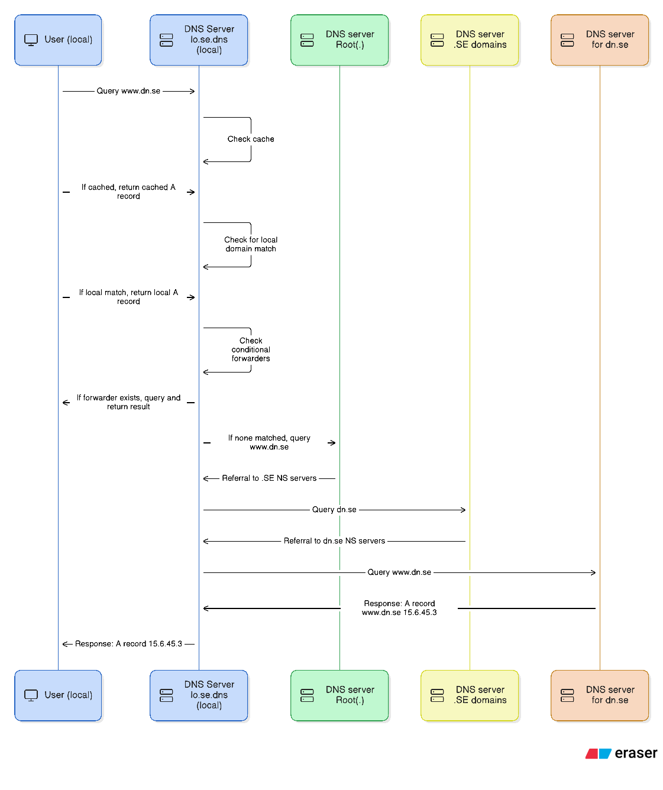

# Learning DNS: From Local Client to Public Servers

__*All IP addresses and DNS servers shown are fictive; this is for educational purposes only!*__

This diagram shows the DNS resolution process, starting from a local client querying a local DNS server, and following the chain through root servers, top level domain (.) servers, and authoritative servers until the A record for `www.dn.se` is returned.

1. User (local) queries the local DNS server (`lo.se.dns`).
2. Local DNS server (`lo.se.dns`) checks its cache, local zones, and conditional forwarders.
3. If not found, the local server queries the root server (.).
4. Root server (one of 13 globally) refers the query to the Top level domain server for .SE.
5. Top level domain server refers the query to the authoritative server for dn.se.
6. Authoritative server for dn.se returns the A record for `www.dn.se`.
7. Local DNS server caches the result and returns it to the local user.
